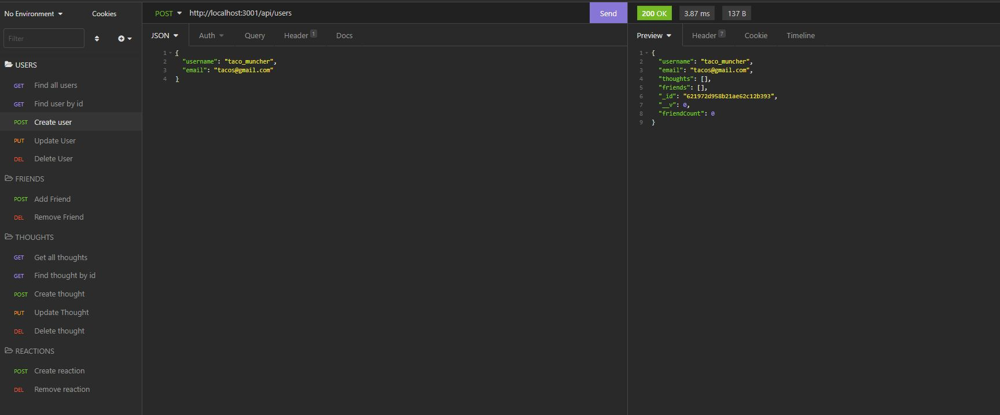

# social-network-api

## Description

The API routes that used in common social networking applications. The API allows for displaying retrieving, creating, and deleting users and thoughts.

## Deployment

This is not an application that can be views. See [this link]() to view the API in action!

## Installation

You can clone the repository, `cd` into the folder and then run `node server.js` in the command line. Give it a try!

## Support

  Contact me if you have any questions:
  - GitHub: [@EzequielMejiasMelo](https://github.com/EzequielMejiasMelo)
  - Email: [ezequiel.mejiasmelo@gmail.com](ezequiel.mejiasmelo@gmail.com)